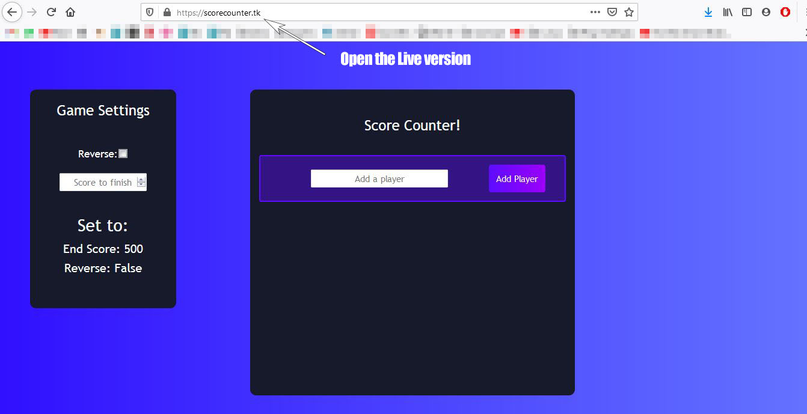
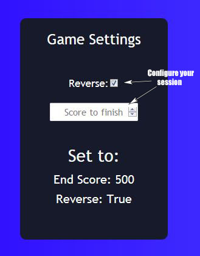
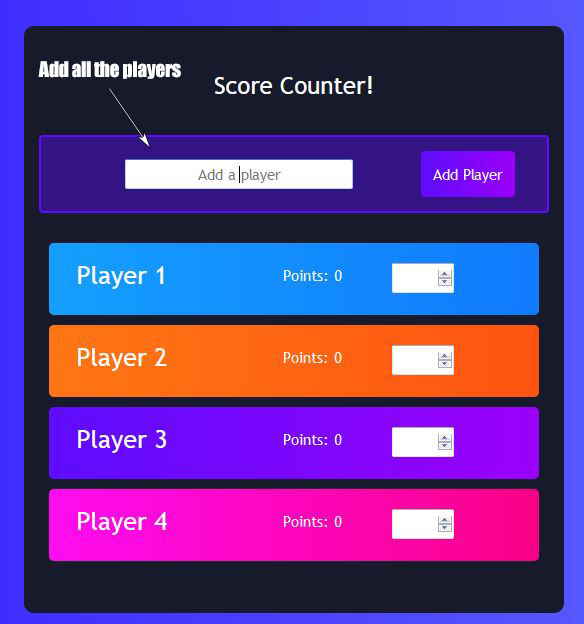
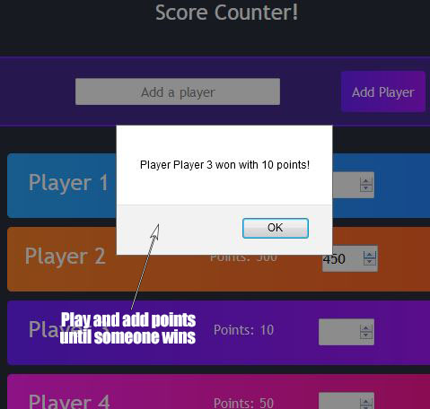

   

# Score counter made with React js

This is the first project I make in my journey through React 👓

## Live version

Check out and use the live version of Score Counter: [here](https://scorecounter.tk/) 📡

## Contributing 🖇️

There are probably lots of things that could be improved, if you find any make sure to make a pull request so I can modify it and learn more!

## License 📄

This project is [MIT](https://choosealicense.com/licenses/mit/) licenced

⌨️ with ❤️ by [Ukliz](https://github.com/Uklizdev) 😊
